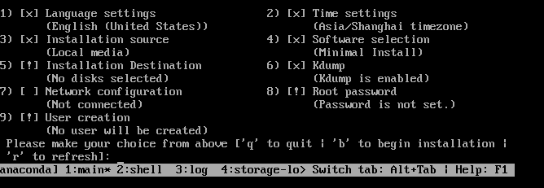
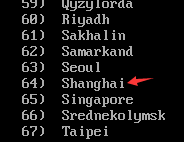
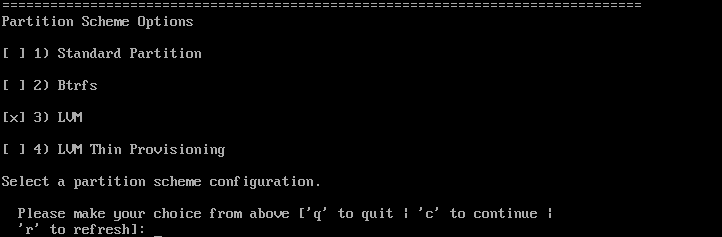
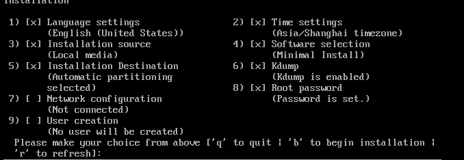

# 镜像安装

开始安装镜像  
`virt-install --virt-type=kvm --name=centos6 --vcpus=1 --memory=1024 --location=/tmp/CentOS.iso --disk path=/home/centos/centos1.qcow2,size=10 --check all=off --graphics none --extra-args='console=ttyS0'`

`

打[X]的是配置好的，[ ! ]是需要配置的  
首先配置时间，选2

选择2，Asia 亚洲

选择64上海  
接下来是5 Installation Destination，安装路径

自动分区选项

分区方案选择

设置Root密码，此时用户可以不必设置

最后完成如下

就可以输入b开始安装了  

安装完成后使用指令查看已安装虚拟机

